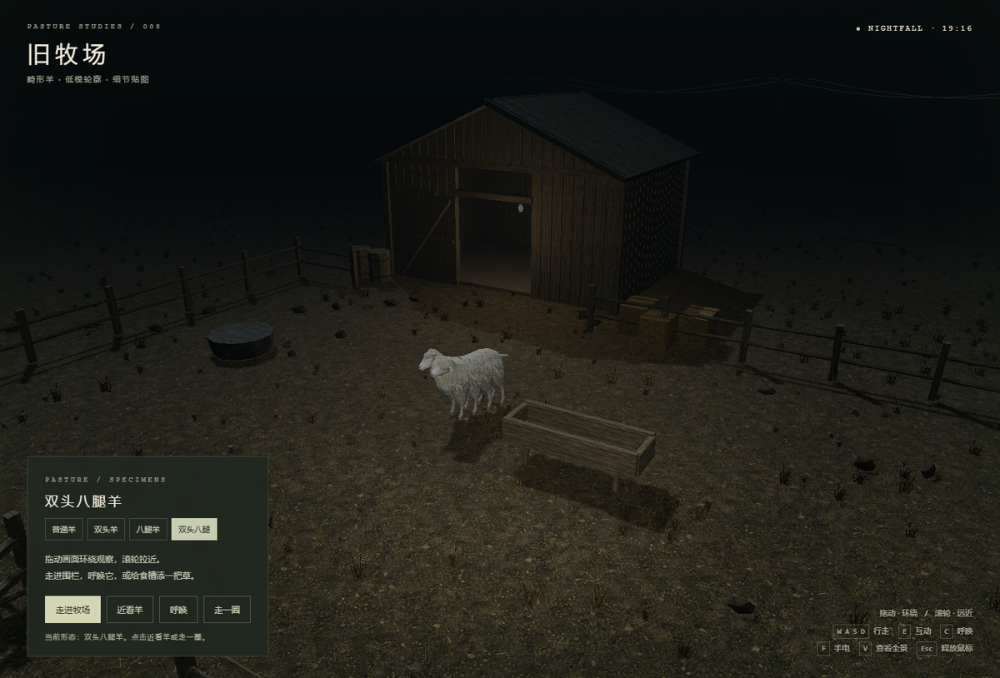

# 旧牧场 · 畸形羊

一个 PS2 风格 low poly 的 3D 牧场小品。夜里走进旧牧场，靠近一只畸形羊：它可以是普通羊，也可以长着两个头、八条腿，或者两者兼有。

纯静态页面，用 three.js 手写场景，没有构建步骤——打开 `index.html` 就能玩。

**在线试玩：** https://freytesla.github.io/deformed-sheep/



## 玩法

| 操作 | 说明 |
| --- | --- |
| 拖动 / 滚轮 | 环绕观察、拉近拉远 |
| `W` `A` `S` `D` | 走进牧场后自由行走 |
| `E` | 与羊或食槽互动（抚摸、添草） |
| `C` | 呼唤羊，让它转向你 |
| `F` | 开/关夜里的手电 |
| `V` | 回到全景视角 |
| `Esc` | 释放鼠标 |

左下角面板可以随时在四种形态间切换：**普通羊 / 双头羊 / 八腿羊 / 双头八腿**。

## 本地运行

因为要用 `fetch` 读取模型，直接双击 `index.html` 在部分浏览器下会被本地文件策略拦住，建议起一个静态服务器：

```bash
python -m http.server 8000
# 然后打开 http://127.0.0.1:8000/
```

## 结构

```
index.html            页面与 UI
scene.js              场景、光照、玩家控制、相机
materials.js          地面/木头/金属/干草的程序化材质贴图
sheep-motion.js       羊的骨架步态（腿的摆动与落蹄）
sheep-navigation.js   羊的寻路与移动
sheep-variants.js     畸形形态：复制头部与腿部的蒙皮网格
vendor/               three.js r128 与 GLTFLoader（MIT）
materials/*.png       材质贴图
sheep/source/sheep.glb  羊的模型（贴图与动画内嵌）
```

羊的模型是从原始资产改造而来：`sheep.glb` 自带骨骼、UV、贴图和一段约 8.4 秒的动画；畸形形态并不是另做模型，而是复用同一套蒙皮，把头部和腿部的顶点子集复制出来，再挂到同一副骨架上，因此新增的头和腿会自动继承原有的贴图与动画。

## 许可

场景代码为本项目所有。随仓库分发的 three.js 及其 GLTFLoader 遵循 MIT 许可，见 `vendor/THREE-LICENSE.txt`。
